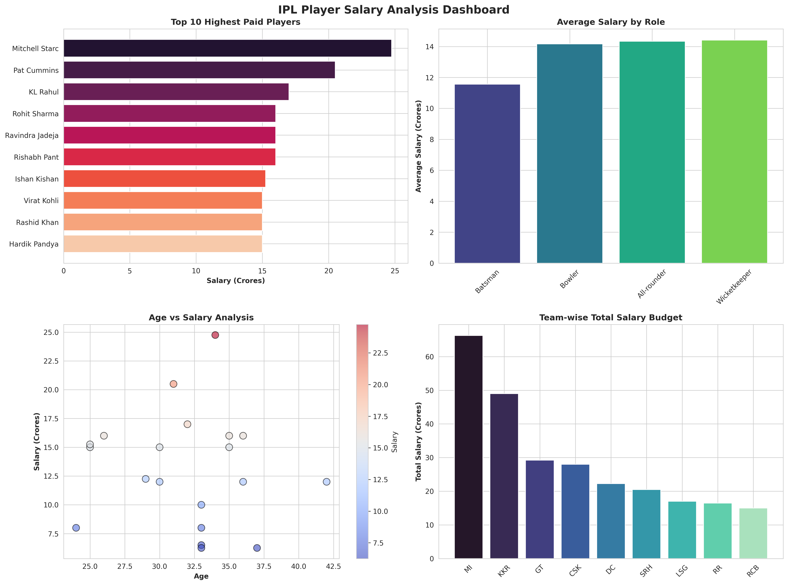

# 📊 IPL Player Salary Analysis

A data analysis project examining IPL player salaries, performance metrics, and team budgets using Python.



## 🎯 Project Overview

This project analyzes IPL (Indian Premier League) player salary data to uncover insights about:
- Which players are the highest paid
- Salary distribution across different roles
- Performance vs. salary analysis
- Team-wise budget allocation
- Best value-for-money players

## 📋 Dataset

The dataset includes 20 IPL players with the following information:
- Player name and team
- Role (Batsman, Bowler, All-rounder, Wicketkeeper)
- Salary in crores (INR)
- Career statistics (matches played, runs scored, wickets taken)
- Age

## 🔍 Key Findings

### 💰 Top 5 Highest Paid Players
1. Mitchell Starc (KKR) - ₹24.75 Cr
2. Pat Cummins (SRH) - ₹20.50 Cr
3. KL Rahul (LSG) - ₹17.00 Cr
4. Rohit Sharma (MI) - ₹16.00 Cr
5. Ravindra Jadeja (CSK) - ₹16.00 Cr

### 📊 Average Salary by Role
- Wicketkeepers: ₹14.42 Cr (highest)
- All-rounders: ₹14.33 Cr
- Bowlers: ₹14.17 Cr
- Batsmen: ₹11.56 Cr (lowest)

### 🏆 Best Value Players (Performance per Crore)
1. **David Warner** - 35.7 runs per match at ₹6.25 Cr
2. **Shubman Gill** - 29.2 runs per match at ₹8.00 Cr
3. **Jos Buttler** - 35.5 runs per match at ₹10.00 Cr

### 🏏 Team Budgets
- **Mumbai Indians (MI)**: ₹66.25 Cr (highest)
- **Kolkata Knight Riders (KKR)**: ₹49.00 Cr
- **Gujarat Titans (GT)**: ₹29.25 Cr

## 🛠️ Technologies Used

- **Python 3.x**
- **Pandas** - Data manipulation and analysis
- **Matplotlib** - Data visualization
- **Seaborn** - Statistical graphics
- **OpenPyXL** - Excel file generation

## 📁 Project Structure

```
ipl-salary-analysis/
│
├── ipl_salary_analysis.py          # Main analysis script
├── ipl_salary_analysis.csv          # Dataset
├── ipl_salary_dashboard.png         # Visualization dashboard
├── performance_vs_salary.png        # Performance analysis chart
├── ipl_salary_insights.xlsx         # Excel report with detailed analysis
└── README.md                        # Project documentation
```

## 🚀 How to Run

1. Clone this repository:
```bash
git clone https://github.com/Krishna-sakha/ipl-salary-analysis.git
cd ipl-salary-analysis
```

2. Install required libraries:
```bash
pip install pandas matplotlib seaborn openpyxl
```

3. Run the analysis:
```bash
python ipl_salary_analysis.py
```

4. Output files will be generated:
   - `ipl_salary_dashboard.png` - Main visualization
   - `performance_vs_salary.png` - Performance analysis
   - `ipl_salary_insights.xlsx` - Excel report

## 📊 Visualizations Generated

### 1. Main Dashboard
Four-panel dashboard showing:
- Top 10 highest-paid players
- Average salary by role
- Age vs. salary scatter plot
- Team-wise total salary

### 2. Performance Analysis
Scatter plot analyzing batsmen's runs per match vs. their salary, with bubble size representing matches played and color showing age.

### 3. Excel Report
Multi-sheet Excel workbook with:
- Raw data
- Top earners analysis
- Role-wise statistics
- Team-wise breakdown

## 💡 Business Insights

1. **Bowlers command premium salaries**: Foreign fast bowlers like Starc and Cummins are the highest-paid players
2. **Experience matters**: Players aged 30-35 earn the highest average salaries
3. **Value investing**: Teams can find great value in players like David Warner and Shubman Gill
4. **MI leads spending**: Mumbai Indians have the highest total salary budget at ₹66.25 Cr

## 🎓 Skills Demonstrated

✅ Data cleaning and preprocessing  
✅ Exploratory data analysis (EDA)  
✅ Statistical analysis  
✅ Data visualization  
✅ Business insights generation  
✅ Report automation  
✅ Python programming  

## 📫 Contact

**Ayush Jha**  
Data Analyst | Python • Excel • SQL  

[](https://www.linkedin.com/in/ayush-jha-616595283/)  
[](https://github.com/Krishna-sakha)

---

## 📝 License

This project is open source and available under the [MIT License](LICENSE).

---

*This project is part of my data analysis portfolio. Feel free to fork and modify!*
